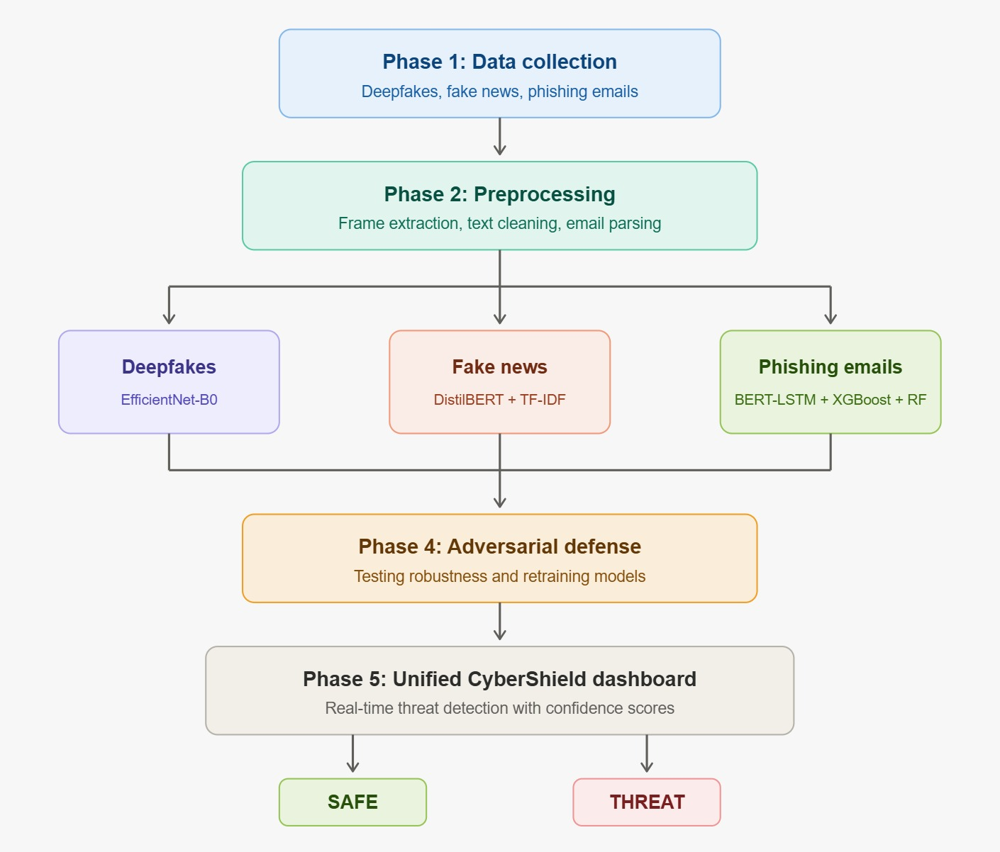

# CyberShield

AI-powered platform for phishing, fake news, and deepfake detection.



## Abstract

The rapid advancement of digital technologies has enabled sophisticated cyber threats including phishing emails, fake news, and AI-generated deepfakes, posing critical risks to digital security, public trust, and democratic processes. CyberShield is a unified AI-powered cybersecurity platform integrating three specialized detection modules. The phishing email detection module employs a BERT-LSTM ensemble achieving 99.28% accuracy. The fake news detection module combines DistilBERT with TF-IDF achieving 95.9% accuracy. The deepfake detection module utilizes EfficientNet-B0 achieving 93.50% image and 95.50% video detection accuracy.

## Team Members

- Disha K – 2023BCSE07AED052
- M Umme Kulsum – 2023BCSE07AED240
- Sahana M – 2023BCSE07AED286
- Sakshi J Kame – 2023BCSE07AED507

**Mentor:** Dr. Rathnakar Achary

## Features

- Multi-model ensemble architecture (BERT-LSTM, EfficientNet-B0, DistilBERT)
- Multi-dataset training for robust generalization
- Adversarial robustness through FGSM and noise injection
- Dual input support for images, videos, emails, and articles
- Unified Streamlit dashboard with real-time threat classification

## Technology Stack

| Category | Tools |
|----------|-------|
| Languages | Python 3.10, 3.11, 3.12 |
| Deep Learning | PyTorch, Transformers, Timm |
| ML | Scikit-learn, XGBoost, TF-IDF |
| Dashboard | Streamlit |
| Training | Google Colab, Kaggle GPU |

## Project Structure
```
CyberShield/
├── src/
│   ├── phishing/        # Phishing email detection
│   ├── fake_news/       # Fake news detection
│   └── deepfakes/       # Deepfake detection
├── docs/                # Documentation
├── architecture.jpeg    # System architecture
└── README.md
```

## Results

| Module | Accuracy |
|--------|----------|
| Phishing Emails | 99.28% |
| Fake News | 95.9% |
| Deepfakes (Image) | 93.50% |
| Deepfakes (Video) | 95.50% |

## Model Files

Model files are large and hosted on Google Drive:
- [Phishing Models]
- [Fake News Models]
- [Deepfake Models]

## How to Run

1. Clone the repository
```bash
git clone https://github.com/dishamurthy-A/CyberShield.git
cd CyberShield
```

2. Install dependencies
```bash
pip install -r requirements.txt
```

3. Run the dashboard
```bash
cd src/phishing
streamlit run app.py
```

## License

This project is for educational purposes - Alliance University, Design Project 2.
